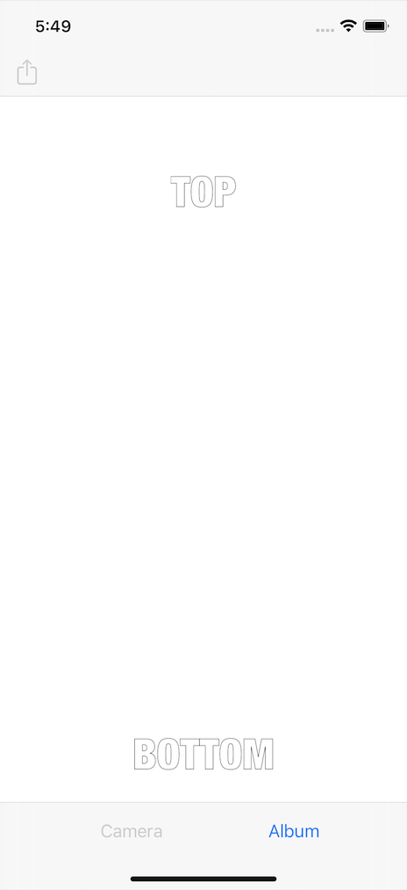
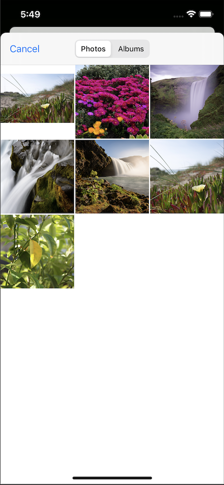
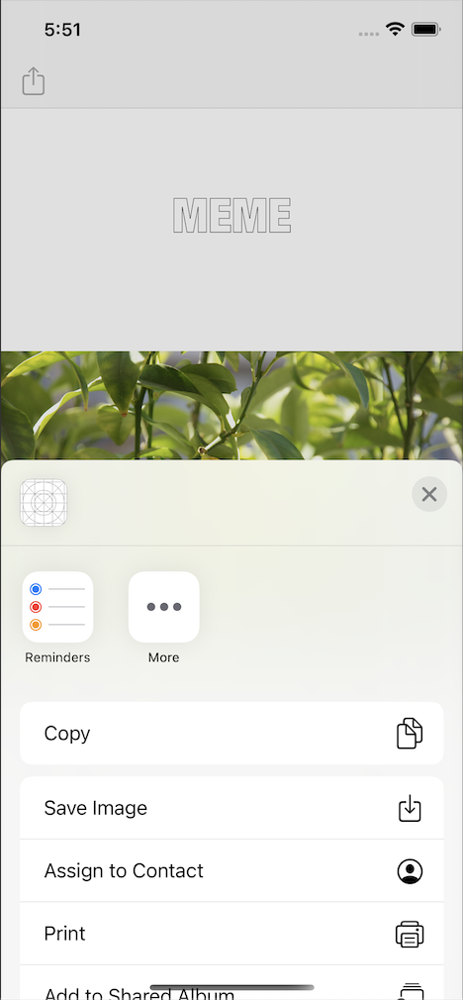

# MemeMe 1.0 iOS App
## udacity.com submission

## App Description

The app create a Meme with an image selected from either the Camera or Photo Library and adds text to Top and Bottom. Then the user can share the photo with friends or save to library.

## Screenshots

